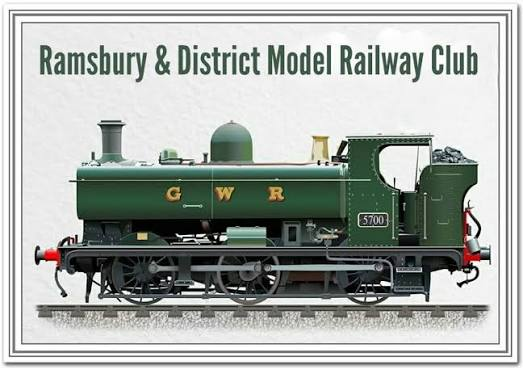

<!-- Navigation & Header Bar -->

  

  <!-- Hidden checkbox for mobile toggle -->
  <input type="checkbox" id="menu-toggle" class="menu-checkbox">
  
  <!-- Hamburger Icon -->
  <label for="menu-toggle" class="hamburger-icon">
    
    
    
  </label>

  <!-- Button Links -->
  

    <a href="index.md" class="mrc-btn">Home</a>
    <a href="layouts.md" class="mrc-btn">Layouts</a>
    <a href="events.md" class="mrc-btn">Events</a>
    <a href="contact.md" class="mrc-btn">Contact</a>
  

<section class="section-card">
  <h2>Welcome to Ramsbury & District MRC!</h2>
  
Welcome to Ramsbury and District Model Railway Club. We are a friendly bunch who meet every Tuesday evening and Saturday morning in Ramsbury, north east Wiltshire. We currently have projects in both N and 00 gauge as well as a fully operational sound-fitted exhibition layout.

</section>

  <section class="section-card">
    <h3>When and Where We Meet</h3>
    
We meet every Tuesday 18:30 - 21:00 and Saturday 09:00 - 13:00.

    
Fox & Hounds Dairy, Crowood Ln, Ramsbury, Wilts, SN8 2HE

  </section>
  

    <iframe src="https://www.google.com/maps/embed?pb=!1m18!1m12!1m3!1d9944.883104670163!2d-1.6050327747172464!3d51.45410282477082!2m3!1f0!2f0!3f0!3m2!1i1024!2i768!4f13.1!3m3!1m2!1s0x487153100a74abb3%3A0xabef1753274a7d0b!2sRamsbury%20and%20District%20Model%20Railway%20Club!5e0!3m2!1sen!2suk!4v1785877718525!5m2!1sen!2suk" width="350" height="350" style="border:0;" allowfullscreen="" loading="lazy" referrerpolicy="strict-origin-when-cross-origin"></iframe>
  

<section class="section-card" id="contact">
  <h3>Contact</h3>
  
If you want to add a contact section, use a simple Markdown block or a custom HTML snippet in this page. Keep the design consistent with the classic railway theme by using green and gold accents.

  
  <!-- Map wrapped in its container -->
  
</section>

<!-- Combined Stylesheet for Navigation, Responsiveness, and General Layout -->
